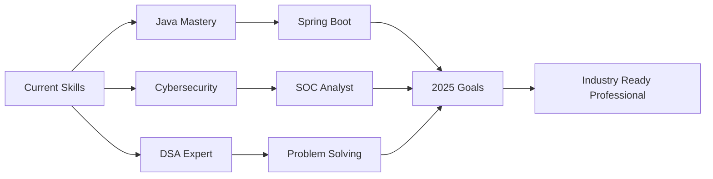

<!-- ================= ANIMATED HEADER ================= -->
<div align="center">
  
</div>

<h1 align="center">
  
</h1>

<div align="center">
  
</div>

<h3 align="center">🔐 Cybersecurity | ☕ Java | 🧠 DSA | 🎥 Tech Content Creator</h3>

---

## 🙋‍♂️ About Me


```yaml
name: SOHAN SINGH
education: B.Tech Final Year - Cybersecurity
university: Kalasaligam University
role: Security Researcher & Java Developer
specialization: ["Blue Team", "SOC", "Ethical Hacking"]
currently_mastering: ["Java", "DSA", "Penetration Testing"]
passion: ["Teaching Tech in Hindi", "Building Secure Apps"]
mission: "Become an Industry-Ready Cybersecurity Expert"
```

- 🎓 **Final Year B.Tech Student** | Cybersecurity Specialization  
- 🏫 **Kalasalingam University**
- 🔐 Passionate about **Blue Team Operations, SOC & Ethical Hacking**
- ☕ Mastering **Java + Data Structures & Algorithms**
- 🎥 Running **3 Tech-focused YouTube Channels** teaching in Hindi
- 🎯 Goal: **Bridge the gap between academic knowledge & industry requirements**
- 💡 Fun Fact: **I debug security vulnerabilities and Java code with equal passion!**

---

## 🧠 My Tech Arsenal

<div align="center">

### 💻 Programming Languages
<p>
  
</p>

### 🌐 Web & App Development
<p>
  
</p>

### 🔐 Cybersecurity & Tools
<p>
  
</p>

### 🛡️ Security Tools & Platforms
<p>
  
  
  
  
  
</p>

</div>

<div align="center">
  
</div>

---

## 📚 Currently Learning & Mastering

<div align="center">
  
</div>

**🎯 2025 Learning Roadmap:**

- ✅ Core Java → Advanced Java → Spring Boot
- ✅ Data Structures & Algorithms (DSA) Mastery
- 🔄 SOC Tools (Splunk, Wireshark, SIEM, tcpdump) - **In Progress**
- 🔄 Secure Web Application Development - **In Progress**
- 📅 Advanced Penetration Testing Techniques
- 📅 Bug Bounty Hunting & Responsible Disclosure
- 📅 Cloud Security (AWS, Azure)
- 📅 Threat Intelligence & Incident Response

<div align="center">


</div>

---

## 🏆 Certifications & Achievements

<div align="center">

| Achievement | Issuer | Status | Link |
|------------|--------|--------|------|
| 🏅 **Cybersecurity Fundamentals** | TryHackMe | ✅ Completed | [View](https://tryhackme.com) |
| 🏅 **Cisco Networking Academy** | Cisco | 🔄 In Progress | [View](#) |
| 🏅 **Cybersecurity Hackathon** | University | ✅ Participant | [View](#) |
| 🏅 **Java Programming** | Coursera | ✅ Certified | [View](#) |
| 🏅 **Ethical Hacking** | Udemy | 🔄 In Progress | [View](#) |

</div>

<div align="center">
  
</div>

---

## 🎥 Tech Content Creation Journey

<div align="center">
  
</div>

<table align="center">
  <tr>
    <th>Channel</th>
    <th>Focus Area</th>
    <th>Language</th>
    <th>Mission</th>
  </tr>
  <tr>
    <td>📺 <b>Teach Me Pentesting Hindi</b></td>
    <td>Ethical Hacking & Pentesting</td>
    <td>Hindi</td>
    <td>Making cybersecurity accessible to Indian students</td>
  </tr>
  <tr>
    <td>📺 <b>Android Development Hindi</b></td>
    <td>Android App Development</td>
    <td>Hindi</td>
    <td>Building the next generation of app developers</td>
  </tr>
  <tr>
    <td>📺 <b>Code With Tech</b></td>
    <td>Programming & DSA</td>
    <td>Hindi</td>
    <td>Simplifying complex coding concepts</td>
  </tr>
</table>

> 🎯 **Teaching cybersecurity, Android development & programming in Hindi to make tech education accessible to everyone**

---

## 💼 Skills Breakdown

<div align="center">

### 🔐 Cybersecurity Expertise
```text
Blue Team Operations       ████████████████░░  85%
Ethical Hacking           ███████████████░░░  80%
Network Security          ██████████████░░░░  75%
SOC Tools                 ████████████░░░░░░  65%
Penetration Testing       ███████████░░░░░░░  60%
```

### ☕ Java & Development
```text
Core Java                 ████████████████░░  85%
Data Structures           ███████████████░░░  80%
Algorithms               ██████████████░░░░  75%
Android Development       ████████████░░░░░░  65%
Spring Framework          ███████████░░░░░░░  60%
```

</div>

<div align="center">
  
</div>

---

## 🌐 Connect With Me

<div align="center">
  
  <a href="https://github.com/As40Gamer">
    
  </a>
  <a href="YOUR_YOUTUBE_LINK">
    
  </a>
  <a href="YOUR_LINKEDIN_LINK">
    
  </a>
  <a href="YOUR_TWITTER_LINK">
    
  </a>
  <a href="mailto:YOUR_EMAIL">
    
  </a>
  <a href="YOUR_INSTAGRAM_LINK">
    
  </a>

</div>

---

## 💡 Random Cybersecurity Quote

<div align="center">
  
</div>

---

## 🎯 2025 Goals & Vision

<div align="center">
  
</div>

- 🎓 Complete B.Tech with distinction
- 💼 Land a role as **SOC Analyst** or **Security Researcher**
- 🏆 Earn industry-recognized certifications (CEH, OSCP)
- 📚 Master Java, Spring Boot & Cloud Technologies
- 🎥 Grow YouTube channels to **10K+ subscribers**
- 🌐 Contribute to **Open Source Security Projects**
- 🔐 Participate in **Bug Bounty Programs**
- 🤝 Mentor aspiring cybersecurity students

---

<div align="center">
  
  
  <h2>⭐ Let's Learn, Build & Secure Together ⭐</h2>
  <h4>Follow for Cybersecurity + Java + DSA + Tech Education 🚀</h4>
  
  
  <em><b>I love connecting with different people</b> so if you want to say <b>hi, I'll be happy to meet you!</b> 😊</em>
  
</div>
